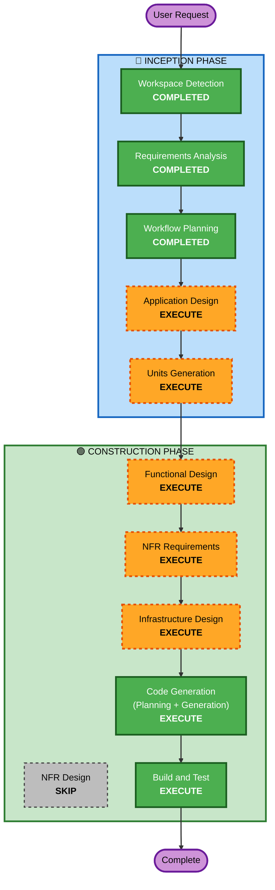

# Execution Plan

## Detailed Analysis Summary

### Change Impact Assessment
- **User-facing changes**: Yes — REST API 엔드포인트 제공 (분석 요청/상태/결과)
- **Structural changes**: Yes — 2-Container 아키텍처 신규 구축
- **Data model changes**: Yes — 영상 분석 JSON, 과실비율 JSON, 구조화된 output JSON 스키마 정의
- **API changes**: Yes — 신규 REST API 설계
- **NFR impact**: Yes — GPU 지원, S3 연동, OpenSearch RAG, 보안 요구사항

### Risk Assessment
- **Risk Level**: Medium
- **Rollback Complexity**: Easy (Greenfield, Docker 기반)
- **Testing Complexity**: Moderate (ML 모델 + LLM + RAG 통합)

---

## Workflow Visualization



### Text Alternative
```
Phase 1: INCEPTION
- Workspace Detection (COMPLETED)
- Requirements Analysis (COMPLETED)
- Workflow Planning (COMPLETED)
- Application Design (EXECUTE)
- Units Generation (EXECUTE)

Phase 2: CONSTRUCTION (per-unit)
- Functional Design (EXECUTE)
- NFR Requirements (EXECUTE)
- NFR Design (SKIP)
- Infrastructure Design (EXECUTE)
- Code Generation (EXECUTE)
- Build and Test (EXECUTE)
```

---

## Phases to Execute

### 🔵 INCEPTION PHASE
- [x] Workspace Detection (COMPLETED)
- [x] Requirements Analysis (COMPLETED)
- [ ] ~~User Stories~~ (SKIPPED — 사용자 미요청, 시스템 내부 파이프라인 중심)
- [x] Workflow Planning (IN PROGRESS)
- [ ] Application Design - **EXECUTE**
  - **Rationale**: 신규 컴포넌트 3개(Video_Analyzer, Fault_Analyzer, Script_Generator) + API 서버 설계 필요. 컴포넌트 간 인터페이스 및 데이터 흐름 정의 필수.
- [ ] Units Generation - **EXECUTE**
  - **Rationale**: 2-Container 분리 아키텍처로 최소 2개 유닛(api-server, video-worker) 필요. 유닛 간 의존성 및 실행 순서 정의.

### 🟢 CONSTRUCTION PHASE (per-unit)
- [ ] Functional Design - **EXECUTE**
  - **Rationale**: 영상 분석 파이프라인, RAG 검색 로직, JSON Schema 정의 등 복잡한 비즈니스 로직 설계 필요.
- [ ] NFR Requirements - **EXECUTE**
  - **Rationale**: GPU 지원, 보안(SECURITY rules), PBT 프레임워크 선택, 성능 요구사항 정의 필요.
- [ ] NFR Design - **SKIP**
  - **Rationale**: NFR 패턴이 비교적 단순 (GPU fallback, S3 연동). Requirements에서 충분히 정의됨. Infrastructure Design에서 커버 가능.
- [ ] Infrastructure Design - **EXECUTE**
  - **Rationale**: Docker 멀티 컨테이너, docker-compose, OpenSearch 연결, S3 연동 등 인프라 설계 필요.
- [ ] Code Generation - **EXECUTE** (ALWAYS)
  - **Rationale**: 실제 코드 구현 — Python 서비스, Dockerfile, docker-compose, 테스트 코드.
- [ ] Build and Test - **EXECUTE** (ALWAYS)
  - **Rationale**: 빌드 및 테스트 지침 생성.

---

## Estimated Timeline
- **Total Stages to Execute**: 8 (AD → UG → FD → NFRA → ID → CG → BT)
- **Stages Skipped**: 2 (User Stories, NFR Design)

## Success Criteria
- **Primary Goal**: Requirement 2-4를 구현하는 Docker 이미지 2개 (api-server + video-worker) 서빙
- **Key Deliverables**:
  - FastAPI REST API 서버 Docker 이미지
  - GPU 배치 워커 Docker 이미지 (영상 분석 + AI 분석)
  - docker-compose.yml (로컬 실행)
  - OpenSearch 데이터 적재 스크립트
  - Property-Based Tests + Unit Tests
- **Quality Gates**:
  - Security Baseline 전체 규칙 준수
  - PBT 전체 규칙 준수
  - docker-compose up으로 로컬 실행 가능
  - API 엔드포인트 정상 응답
