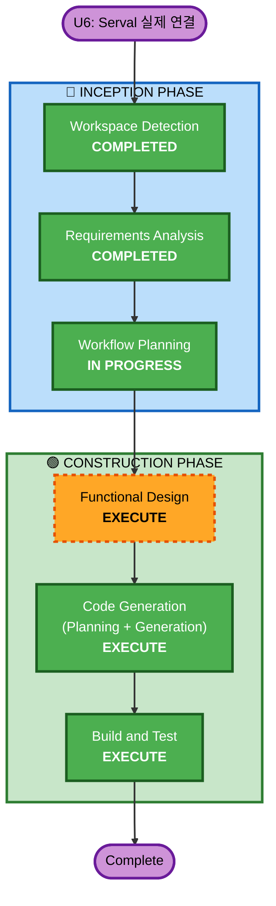

# Execution Plan — U6: Serval 실제 연결

## Detailed Analysis Summary

### Transformation Scope
- **Transformation Type**: Single component 수정 (integration 모듈 내부)
- **Primary Changes**: mock script 로딩 → Serval AnalysisPipeline 직접 import 호출
- **Related Components**: `integration/api.py`, `integration/adapters/serval_to_ssol.py`, `ad-hoc/serval/` (읽기 전용)

### Change Impact Assessment
- **User-facing changes**: No — API 인터페이스 동일 (POST /analyze, GET /jobs/{id})
- **Structural changes**: No — 기존 아키텍처 유지, import 경로만 추가
- **Data model changes**: No — StructuredAnalysis 모델 그대로 사용
- **API changes**: No — 응답 형식 동일
- **NFR impact**: Yes — 실제 LLM/S3/OpenSearch 호출로 latency 증가 (비동기 처리 이미 구현됨)

### Component Relationships
```
integration/api.py (수정)
    └── integration/adapters/serval_to_ssol.py (수정)
         └── ad-hoc/serval/worker/pipeline.py (import, 읽기 전용)
              ├── ad-hoc/serval/worker/video_analyzer.py
              ├── ad-hoc/serval/worker/fault_analyzer.py
              │    └── ad-hoc/andy/accident-rag/ (RAG package)
              └── ad-hoc/serval/worker/script_generator.py

integration/server.py (수정 — 실제 분석 호출 연결)
```

### Risk Assessment
- **Risk Level**: Medium
- **Rollback Complexity**: Easy — MOCK_SERVAL 플래그로 즉시 롤백 가능
- **Testing Complexity**: Moderate — 실제 AWS 서비스 필요

---

## Workflow Visualization



## Text Alternative
```
Phase 1: INCEPTION
  - Workspace Detection (COMPLETED)
  - Requirements Analysis (COMPLETED)
  - Workflow Planning (IN PROGRESS)

Phase 2: CONSTRUCTION
  - Functional Design (EXECUTE)
  - Code Generation (EXECUTE)
  - Build and Test (EXECUTE)
```

---

## Phases to Execute

### 🔵 INCEPTION PHASE
- [x] Workspace Detection (COMPLETED — session resumption)
- [x] Requirements Analysis (COMPLETED)
- [x] Workflow Planning (IN PROGRESS)
- [x] User Stories — SKIP
  - **Rationale**: 내부 통합 작업. 새로운 사용자 시나리오 없음.
- [x] Application Design — SKIP
  - **Rationale**: 새 컴포넌트/서비스 없음. 기존 adapter 패턴 내 수정.
- [x] Units Generation — SKIP
  - **Rationale**: 단일 unit(U6) 이미 정의됨.

### 🟢 CONSTRUCTION PHASE
- [ ] Functional Design — **EXECUTE**
  - **Rationale**: PBT-01 요구 — 데이터 변환/비즈니스 로직의 testable property 식별 필요. Serval pipeline 호출 흐름과 에러 처리 명세.
- [ ] NFR Requirements — SKIP
  - **Rationale**: 기존 NFR(비동기, 에러처리, 로깅) 그대로 사용. 신규 tech stack 없음.
- [ ] NFR Design — SKIP
  - **Rationale**: NFR Requirements 스킵이므로 연쇄 스킵.
- [ ] Infrastructure Design — SKIP
  - **Rationale**: 인프라 변경 없음. 기존 S3/Bedrock/OpenSearch 그대로 사용.
- [ ] Code Generation — **EXECUTE** (ALWAYS)
  - **Rationale**: Integration 코드 수정 + PBT 테스트 생성
- [ ] Build and Test — **EXECUTE** (ALWAYS)
  - **Rationale**: E2E 검증 (샘플 영상 기반)

---

## Estimated Timeline
- **Total Stages**: 3 (Functional Design → Code Generation → Build & Test)
- **Estimated Duration**: ~30분

## Success Criteria
- **Primary Goal**: `POST /analyze` 호출 시 Serval의 실제 StructuredAnalysis 출력 사용
- **Key Deliverables**:
  - 수정된 `integration/api.py` — Serval AnalysisPipeline 직접 호출
  - 수정된 `integration/adapters/serval_to_ssol.py` — StructuredAnalysis Pydantic model 직접 수용
  - PBT 테스트 — round-trip, invariant property 검증
  - E2E 테스트 통과 (샘플 영상 기반)
- **Quality Gates**:
  - PBT rules 준수 (PBT-01~PBT-10)
  - Security rules 준수 (SECURITY-03, 05, 09, 12, 15)
  - MOCK_SERVAL=true 플래그로 rollback 가능
